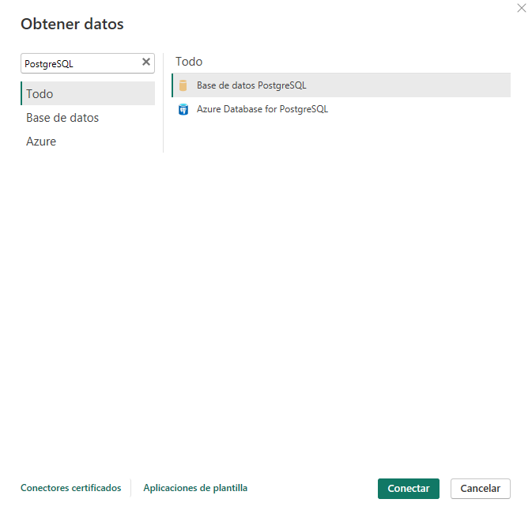
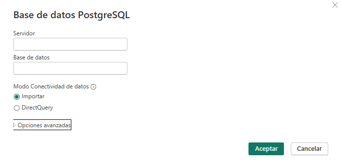
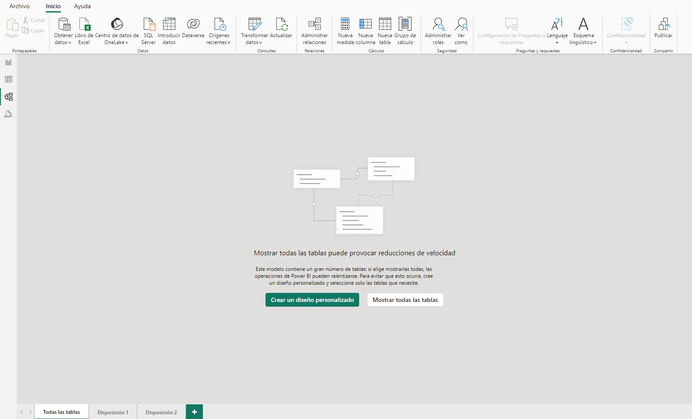

## 1. Carga Completa de la Base de Datos

### Descripción

Este método consiste en conectar Power BI directamente a toda la base de datos, lo que implica cargar todas las tablas disponibles en la misma. Este enfoque es adecuado cuando se requiere trabajar con una amplia variedad de datos o no se tiene un conocimiento específico de las consultas que se van a necesitar.

### Ventajas
- **Facilidad de configuración**: Al conectar toda la base de datos, no es necesario crear consultas SQL personalizadas.
- **Acceso completo**: Se tiene acceso a todas las tablas y columnas de la base de datos, lo que permite flexibilidad en los análisis.
- **Ideal para exploración**: Este método es útil si se requiere explorar los datos en Power BI antes de definir consultas más específicas.

### Desventajas
- **Mayor tiempo de carga**: Si la base de datos es grande, el tiempo de carga inicial puede ser considerable.
- **Uso elevado de recursos**: Power BI tendrá que manejar grandes volúmenes de datos, lo que puede afectar el rendimiento.
- **Datos innecesarios**: Se cargan muchas tablas y campos que quizás no se utilicen en el informe final.

### Pasos para la carga completa

1. **Conexión a PostgreSQL**:
   - En Power BI, ve a la pestaña "Inicio" y selecciona "Obtener datos" > "PostgreSQL".
   

   - Al seleccionar *Base de datos PostgreSQL*, se abrirá una ventana donde deberás introducir varios detalles esenciales. A continuación, se describen los campos que aparecerán en la pantalla:

        1. **Servidor**: 
            - Aquí debes ingresar la dirección del servidor donde está alojada tu base de datos PostgreSQL. Esto puede ser una dirección IP o un nombre de dominio. Si estás trabajando localmente, puedes usar `localhost` o `127.0.0.1`.

        2. **Base de datos**: 
            - En este campo, especificas el nombre de la base de datos a la que deseas conectarte. Asegúrate de que el nombre esté correctamente escrito para evitar problemas de conexión.

        3. **Modo de conectividad de datos**: 
            - En esta sección, puedes seleccionar el modo de conectividad que deseas utilizar. Las opciones son:
                - **Importar**: Esta opción cargará una copia de los datos en la memoria de Power BI. Es ideal para un análisis más rápido y eficiente, pero requiere que programen actualizaciones periódicas para mantener los datos sincronizados con la base de datos.
                - **DirectQuery**: Seleccionar esta opción permite que Power BI realice consultas directamente a la base de datos en tiempo real. Esto asegura que siempre trabajas con datos actualizados, pero puede impactar en el rendimiento de las visualizaciones.

        

   
2. **Seleccionar tablas**:
   - Power BI te mostrará todas las tablas disponibles en la base de datos.
   - Selecciona las tablas que deseas cargar. Si necesitas cargar todas, simplemente selecciona todas las tablas disponibles.

3. **Cargar datos**:
   - Selecciona la opción "Cargar" para traer los datos a Power BI. Power BI comenzará a cargar toda la información seleccionada.

4. **Modelado de datos**:
   - Una vez que los datos se hayan cargado, puedes ir a la pestaña "Modelo" para crear relaciones entre las tablas si no se han detectado automáticamente.
   

### Ejemplo de uso

Este método es útil cuando tienes un informe que necesita acceder a varias tablas relacionadas, como un informe de ventas que involucra datos de clientes, productos y facturación. La carga completa te permitirá explorar todos estos datos sin preocuparte por definir consultas específicas.